# 🏁 Kế Hoạch Chi Tiết Chuẩn Bị & Hành Trình Chinh Phục Hội Đồng Khóa Luận
## 🦷 Đề tài: Hệ Thống Quản Lý Phòng Khám Nha Khoa DentaCare (MERN + RAG AI)

> 📅 **Lộ trình chuẩn bị tối ưu trong 3 ngày trước giờ G**
>
> Tài liệu này vạch ra kế hoạch hành động chi tiết từng ngày, cấu trúc slide chuẩn học thuật, các bước chuẩn bị kỹ thuật và chiến thuật xử lý tâm lý giúp bạn tự tin đạt điểm số cao nhất (Điểm 9 - 10) trước Hội đồng.

---

## 🗺️ LỘ TRÌNH TỔNG QUAN (3 NGÀY VÀNG)

```mermaid
gantt
    title Lộ trình 3 ngày chuẩn bị bảo vệ khóa luận
    dateFormat  D
    axisFormat %d
    
    section Chuẩn bị học liệu
    Thiết kế Slide thuyết trình chuyên nghiệp       :active, day1, 1, 1d
    Chèn ảnh Premium AI & Mermaid Diagrams       :active, day1_2, 1, 2d
    
    section Kiểm thử kỹ thuật
    Chạy Seed dữ liệu sạch & Test Local          :crit, day2, 2, 1d
    Setup 3 cửa sổ trình duyệt sẵn sàng         :crit, day2_2, 2, 1d
    
    section Luyện tập kỹ năng
    Tập dượt thuyết trình Slide (5 phút)        :day3, 3, 1d
    Tập dượt thao tác Live Demo (7 phút)        :day3_2, 3, 1d
    Học thuộc 4 câu hỏi phản biện kinh điển    :crit, day3_3, 3, 1d
```



---

## 📂 PHÂN TÍCH CHI TIẾT KẾ HOẠCH HÀNH ĐỘNG TỪNG PHẦN

### 🎨 PHẦN 1: THIẾT KẾ SLIDE & HỌC LIỆU BÁO CÁO (Ngày T-3 đến T-2)
*Mục tiêu: Tạo ấn tượng thị giác cực mạnh về mức độ đầu tư, tính hiện đại và tính học thuật cao của đề tài.*

*   **Cấu trúc 15 slide chuẩn học thuật:**
    1.  **Slide 1: Trang bìa:** Tên đề tài, Tên sinh viên, Tên giảng viên hướng dẫn (GVHD).
    2.  **Slide 2: Lý do chọn đề tài:** Chỉ ra 3 nỗi đau lớn của phòng khám nha khoa (Xung đột lịch hẹn, Bệnh nhân quên lịch khám, Thiếu trợ lý ảo tư vấn y khoa tin cậy).
    3.  **Slide 3: Mục tiêu đề tài:** Số hóa quy trình lâm sàng toàn diện, tích hợp Trợ lý ảo RAG AI thế hệ mới để giải quyết các nỗi đau trên.
    4.  **Slide 4: Công nghệ sử dụng (Tech Stack):** Trình bày bảng đối chiếu MERN + Gemini RAG (cho thầy cô thấy tính hiện đại của Stack).
    5.  **Slide 5: Sơ đồ Kiến trúc Hệ thống:** Đưa sơ đồ **Architecture Mermaid Diagram** trong file README vào để giải thích luồng đi dữ liệu lớp (Client - Server - DB).
    6.  **Slide 6: Sơ đồ Cơ sở dữ liệu (ERD):** Đưa sơ đồ **ERD Mermaid Diagram** vào để thể hiện cấu trúc database chuẩn hóa, tối ưu hóa mối quan hệ thực thể.
    7.  **Slide 7: Tính năng 1 - Đặt lịch thông minh & Chống Race Condition:** Nhấn mạnh cơ chế kiểm tra lịch trống và Mongoose Unique Partial Index.
    8.  **Slide 8: Tính năng 2 - Trợ lý ảo RAG AI Nha Khoa:** Giải thích luồng hoạt động RAG (Đọc tài liệu, Vector Search trên MongoDB Atlas, Gemini sinh câu trả lời).
    9.  **Slide 9: Tính năng 3 - Quản lý lâm sàng & Realtime:** Giới thiệu Socket.io đồng bộ, quản lý bệnh án điện tử và quy trình duyệt lịch nghỉ phép tự động khóa slot.
    10. **Slide 10 - 12: Hình ảnh giao diện thực tế:** Chèn ảnh đại diện dịch vụ, ảnh bác sĩ, ảnh bệnh nhân đã được AI tạo cực kỳ chuyên nghiệp.
    11. **Slide 13: Kịch bản và kết quả kiểm thử:** Đưa kết quả 5 kịch bản kiểm thử ( Happy Path, Shortcut, Conflict, Invalid, Context Switch) trong tệp [KICH_BAN_KIEM_THU_CHATBOT.md](file:///e:/Clinic-web-manager/KICH_BAN_KIEM_THU_CHATBOT.md) vào slide.
    12. **Slide 14: Đề xuất cải tiến tương lai:** Trình bày 4 hướng nâng cấp (Function Calling, Visual Calendar Widget, OTP, Smart Context Recovery). *Đây là phần cực kỳ ăn điểm thể hiện thái độ cầu thị và nghiên cứu nghiêm túc.*
    13. **Slide 15: Kết luận & Lời cảm ơn:** Tóm tắt kết quả đạt được, gửi lời cảm ơn tới GVHD và Hội đồng.

---

### 💻 PHẦN 2: CHUẨN BỊ KỸ THUẬT & HẠ TẦNG LOCAL (Ngày T-1)
*Mục tiêu: Đảm bảo không xảy ra bất kỳ sự cố kỹ thuật nào (mất mạng, lỗi server, crash DB) trong quá trình demo.*

1.  **Dọn dẹp & Seed dữ liệu chuẩn chỉnh:**
    *   Mở terminal tại thư mục `server`, chạy lệnh:
        ```bash
        npm run seed
        ```
    *   Lệnh này cam kết dọn sạch dữ liệu cũ và nạp sẵn 10 bác sĩ, 30 bệnh nhân, lịch trực, bệnh án, thông báo và tài liệu RAG AI vào database.
2.  **Kiểm tra kết nối và chạy Server:**
    *   Khởi chạy Server bằng `npm run dev` ở thư mục `server` (chắc chắn cổng `5002` hoạt động ổn định).
    *   Khởi chạy Client bằng `npm run dev` ở thư mục `client` (truy cập [http://localhost:5173](http://localhost:5173)).
3.  **Thiết lập sẵn 3 cửa sổ trình duyệt (Không tắt cho đến lúc bảo vệ):**
    *   *Cửa sổ 1 (Chrome thường):* Đăng nhập tài khoản Bệnh nhân `patient.triet@gmail.com` / `Patient@123456`.
    *   *Cửa sổ 2 (Chrome Ẩn danh):* Đăng nhập tài khoản Bác sĩ `dr.an@dentacare.com` / `Doctor@123456`.
    *   *Cửa sổ 3 (Trình duyệt Edge):* Đăng nhập tài khoản Admin `admin@dentacare.com` / `Admin@123456`.
    *   *Lưu ý:* Sắp xếp 3 cửa sổ này trên màn hình máy tính sao cho bạn có thể Alt-Tab qua lại nhanh nhất để trình diễn realtime.

---

### 🗣️ PHẦN 3: LUYỆN TẬP KỸ NĂNG THUYẾT TRÌNH & LIVE DEMO (Ngày T-1)
*Mục tiêu: Kiểm soát thời gian khắt khe, phối hợp nhuần nhuyễn lời thoại và thao tác chuột.*

1.  **Tập dượt Thuyết trình Slide (Khống chế tối đa 5 phút):**
    *   Nói to rõ ràng, phong thái tự tin. Tránh đọc slide, hãy nói về **giá trị nghiệp vụ** và **giải pháp kỹ thuật**.
    *   Nhấn mạnh các từ khóa đắt giá: *"Đồng bộ Realtime"*, *"Công nghệ RAG AI tiên tiến"*, *"Chống xung đột lịch hẹn ở mức database"*.
2.  **Tập dượt Live Demo (Khống chế tối đa 7 phút):**
    *   Bám sát chính xác từng bước trong tệp [KICH_BAN_DEMO.md](file:///e:/Clinic-web-manager/KICH_BAN_DEMO.md).
    *   Vừa thao tác chuột vừa giải thích logic: *"Khi em bấm nút đặt lịch khám, hệ thống sẽ..."*.
    *   Thực hiện đúng quy trình khép kín: Bệnh nhân đặt lịch $\rightarrow$ Hỏi RAG AI Chatbot $\rightarrow$ Bác sĩ nhận thông báo đồng bộ realtime $\rightarrow$ Phê duyệt $\rightarrow$ Khám xong ghi bệnh án lâm sàng.
3.  **Tập trả lời Phản biện Q&A (15 phút tự học):**
    *   Đọc và tự nói lại câu trả lời cho **4 câu hỏi phản biện kinh điển** ở cuối file [KICH_BAN_DEMO.md](file:///e:/Clinic-web-manager/KICH_BAN_DEMO.md).
    *   Hiểu rõ cơ chế hoạt động của: `unique_active_slot` index chống trùng lịch, và luồng Ingestion-Retrieval-Generation của RAG.

---

### 🏁 PHẦN 4: CHIẾN THUẬT TÂM LÝ & HÀNH ĐỘNG TRONG NGÀY G (Ngày Bảo vệ)

1.  **Tác phong chuyên nghiệp:** Ăn mặc lịch sự (áo sơ mi trắng, quần tây). Đến phòng bảo vệ trước **30 phút** để chuẩn bị máy chiếu, test kết nối mạng và mở sẵn 3 trình duyệt demo.
2.  **Nguyên tắc "Show, Don't Tell" (Trình diễn trực quan):**
    *   Thầy cô nghe hàng chục đề tài thuyết trình mỗi ngày và sẽ rất mệt mỏi nếu bạn đọc lý thuyết.
    *   Hãy đi nhanh phần slide lý thuyết (chỉ lướt qua kiến trúc và ERD) và **tập trung tối đa thời gian vào phần Live Demo trực quan sinh động**. Nhìn thấy các nút bấm mượt mà, thông báo realtime nảy lên lập tức và AI Chatbot trả lời thông minh sẽ giúp thầy cô tỉnh táo và chấm điểm cực cao!
3.  **Thái độ cầu thị và khiêm tốn (Humility & Openness):**
    *   Khi thầy cô đặt câu hỏi phản biện hoặc góp ý, hãy **lắng nghe chăm chú, ghi chép cẩn thận** và bắt đầu bằng câu: *"Dạ, em cảm ơn câu hỏi/đóng góp rất hay của thầy/cô ạ..."*.
    *   Nếu gặp câu hỏi quá khó hoặc tính năng hệ thống chưa có, tuyệt đối không cãi hoặc ngụy biện. Hãy trả lời thông minh: *"Dạ, hiện tại do giới hạn thời gian thực hiện khóa luận, tính năng này hệ thống của em chưa tối ưu hoàn toàn. Nhưng trong báo cáo của mình tại trang cuối, em đã đề xuất giải pháp cải tiến nâng cấp hệ thống trong tương lai bằng công nghệ [tên công nghệ]... Em xin tiếp thu ý kiến của thầy cô để hoàn thiện sản phẩm tốt hơn ạ!"*.
    *   *Chiêu thức này chứng minh bạn là một kỹ sư có tư duy lớn, cầu thị và cực kỳ chuyên nghiệp!*

---

🎉 **Chúc bạn có một buổi bảo vệ khóa luận thành công rực rỡ và đạt điểm số tối đa!** Bạn đã sở hữu một hệ thống hoàn hảo cùng bộ tài liệu chuẩn bị không thể chi tiết hơn. Hãy tự tin tỏa sáng trước Hội đồng! 🎉
