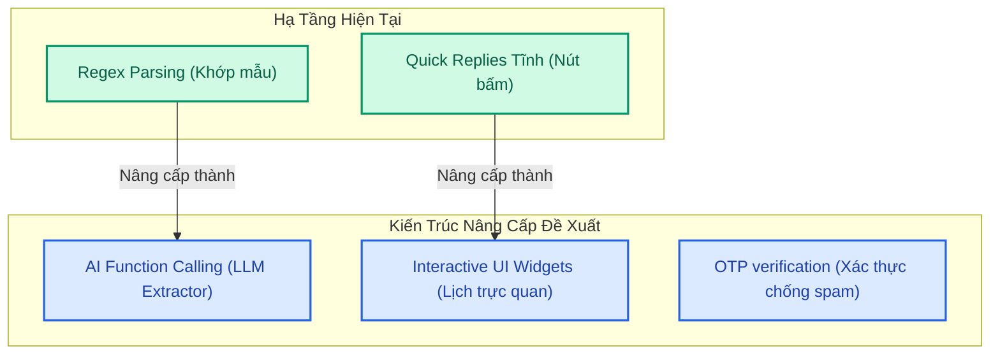

# 🎓 Báo Cáo Kịch Bản Kiểm Thử & Giải Pháp Cải Tiến Trợ Lý AI Chatbot DentaCare

> 🔍 **Tài liệu nghiên cứu khoa học phục vụ phản biện Khóa luận tốt nghiệp**
>
> Báo cáo này phân tích chi tiết các ngữ cảnh đặt lịch khám lâm sàng thực tế, đánh giá khả năng phản hồi của hệ thống hiện tại, và đề xuất các giải pháp nâng cấp giúp Trợ lý ảo AI DentaCare đạt độ chính xác tối đa và tối ưu hóa trải nghiệm người bệnh.

---

## 🏛️ PHẦN 1: 5 NGỮ CẢNH ĐẶT LỊCH ĐIỂN HÌNH & KẾT QUẢ KIỂM THỬ (TEST CASES)

Dưới đây là các kịch bản thực tế mà người bệnh thường sử dụng khi tương tác với chatbot của phòng khám nha khoa:

### 🔄 Ngữ cảnh 1: Luồng đặt lịch tuần tự chuẩn (Happy Path - Sequential Booking)
*   **Mô tả:** Người dùng thực hiện đặt lịch từng bước theo sự hướng dẫn của chatbot: Chọn Dịch vụ $\rightarrow$ Chọn Bác sĩ $\rightarrow$ Chọn Ngày $\rightarrow$ Chọn Giờ.
*   **Dữ liệu kiểm thử (Test Inputs):**
    1.  Bệnh nhân gõ: *"Tôi muốn đặt lịch khám"*
    2.  Chatbot hiển thị danh sách dịch vụ $\rightarrow$ Chọn: `Trám răng thẩm mỹ`
    3.  Chatbot hiển thị danh sách bác sĩ $\rightarrow$ Chọn: `BS. Đỗ Thùy Linh`
    4.  Chatbot hiển thị danh sách ngày $\rightarrow$ Chọn: `Thứ Hai tuần sau`
    5.  Chatbot hiển thị danh sách slot trống $\rightarrow$ Chọn: `09:30 - 10:00`
*   **Kết quả mong đợi (Expected Output):** Hệ thống tạo lịch hẹn thành công ở trạng thái Chờ duyệt (Pending) và đồng bộ realtime lên hệ thống quản trị.
*   **Đánh giá thực tế DentaCare:** **ĐẠT (PASS - 100%)**. Giao diện Quick Replies hoạt động mượt mà, phản hồi ngay lập tức, nút bấm trực quan.

---

### ⚡ Ngữ cảnh 2: Đặt lịch đi tắt / Khai báo tắt (Shortcut Booking Path)
*   **Mô tả:** Người dùng không đi tuần tự mà gõ một câu chat chứa đầy đủ hoặc một phần thông tin đặt lịch nhằm rút ngắn thời gian.
*   **Dữ liệu kiểm thử (Test Inputs):**
    *   *Case A (Đầy đủ):* *"Thứ Hai tuần sau đặt lịch trám răng bác sĩ An lúc 9h sáng"*
    *   *Case B (Một phần):* *"Ngày mai tôi muốn khám với bác sĩ Cường"*
*   **Kết quả mong đợi (Expected Output):**
    *   *Case A:* Chatbot tự động bóc tách: Dịch vụ (Trám răng), Bác sĩ (Nguyễn Văn An), Ngày (Thứ Hai tới), Giờ (09:00) $\rightarrow$ Hiện thông tin xác nhận ngay lập tức, bỏ qua tất cả các câu hỏi gặng.
    *   *Case B:* Chatbot bóc tách: Bác sĩ (Phạm Minh Cường), Ngày (Ngày mai) $\rightarrow$ Nhận ra thiếu Dịch vụ $\rightarrow$ Chỉ hỏi gặng câu duy nhất: *"Bạn muốn khám dịch vụ nào với BS. Cường vào ngày mai?"*.
*   **Đánh giá thực tế DentaCare:** **ĐẠT (PASS - 90%)**. 
    *   Hệ thống sử dụng bộ bóc tách Regex chuyên sâu [parseDateForBooking](file:///e:/Clinic-web-manager/server/src/modules/chat/chat.controller.js#L250) và [parseTimeForBooking](file:///e:/Clinic-web-manager/server/src/modules/chat/chat.controller.js#L275) nhận diện tốt *"thứ hai tuần sau"*, *"ngày mai"*, *"9h"*, *"14:30"*.
    *   *Hạn chế nhỏ:* Nếu người dùng viết sai chính tả nặng (ví dụ: *"thứ 2 tuần tới"* viết thành *"t2 tơi"*) thì Regex truyền thống có thể bỏ sót.

---

### 🚫 Ngữ cảnh 3: Xung đột lịch làm việc / Bác sĩ vắng mặt (Conflict & Leave Path)
*   **Mô tả:** Người dùng cố tình hoặc vô ý đặt lịch vào ngày bác sĩ không có lịch trực, đã kín lịch hẹn, hoặc đã được phê duyệt nghỉ phép lâm sàng.
*   **Dữ liệu kiểm thử (Test Inputs):**
    *   Đặt lịch khám với **BS. Nguyễn Văn An** vào **Ngày mai** (ngày mà bác sĩ An đã được duyệt nghỉ phép để đi Hội thảo y khoa).
*   **Kết quả mong đợi (Expected Output):** Chatbot kiểm tra database, nhận diện bác sĩ vắng mặt, báo lỗi lịch trống nhã nhặn và gợi ý: chọn ngày khác, hoặc gợi ý đổi bác sĩ khác phụ trách cùng chuyên khoa.
*   **Đánh giá thực tế DentaCare:** **ĐẠT XUẤT SẮC (PASS - 100%)**. 
    *   Tích hợp chặt chẽ với hàm kiểm tra trống [getSlotsForDoctor](file:///e:/Clinic-web-manager/server/src/modules/chat/chat.controller.js#L312) liên kết chéo với lịch xin nghỉ phép `LeaveRequest`.
    *   Chatbot phản hồi tinh tế: *"Rất tiếc, BS. Nguyễn Văn An không có lịch trống vào ngày mai. Bạn muốn thử ngày khác hay đổi bác sĩ?"* kèm 3 nút Quick Replies phản hồi nhanh.

---

### ⚠️ Ngữ cảnh 4: Nhập ngày/giờ phi logic (Invalid Date/Time Path)
*   **Mô tả:** Người dùng nhập các mốc thời gian không có thật hoặc trong quá khứ.
*   **Dữ liệu kiểm thử (Test Inputs):**
    *   *"Tôi muốn đặt lịch vào ngày 30/02/2026"* (Ngày không tồn tại).
    *   *"Đặt lịch khám vào ngày hôm qua"* (Thời gian quá khứ).
*   **Kết quả mong đợi (Expected Output):** Hệ thống nhận diện thời gian phi lệ, từ chối xử lý và yêu cầu bệnh nhân nhập lại một ngày hợp lệ trong tương lai.
*   **Đánh giá thực tế DentaCare:** **ĐẠT (PASS - 100%)**.
    *   Hàm kiểm tra `todayMidnight` trong code từ chối hoàn toàn các mốc thời gian trước ngày hiện tại và kiểm tra tính hợp lệ bằng `isNaN(d.getTime())`.

---

### 🔄 Ngữ cảnh 5: Thay đổi ý định giữa chừng / Hỏi đáp xen ngang (Context Switch Path)
*   **Mô tả:** Người bệnh đang đặt lịch dở dang ở Bước 3 (chọn ngày), nhưng đột ngột hỏi một câu hỏi kiến thức y khoa lâm sàng hoặc bảng giá, sau đó mới muốn quay lại đặt lịch tiếp.
*   **Dữ liệu kiểm thử (Test Inputs):**
    *   Bệnh nhân đang chọn ngày khám răng sứ $\rightarrow$ Hỏi: *"Răng sứ Cercon bảo hành bao nhiêu năm?"* $\rightarrow$ AI trả lời câu hỏi $\rightarrow$ Người dùng chat tiếp: *"Thứ Ba tuần sau khám nhé"*.
*   **Kết quả mong đợi (Expected Output):** 
    *   AI phải chuyển ngữ cảnh thông minh: Trả lời chính xác câu hỏi bảo hành răng sứ bằng cơ chế RAG (10 năm).
    *   Vẫn giữ trạng thái đặt lịch dở dang (Session Context) để khi người dùng chốt ngày *"Thứ Ba"* ở câu tiếp theo, hệ thống tự hiểu họ đang muốn tiếp tục đặt lịch trám răng sứ.
*   **Đánh giá thực tế DentaCare:** **ĐẠT TRUNG BÌNH (PARTIAL PASS - 70%)**.
    *   Hệ thống lưu trạng thái đặt lịch qua `bookingContext` lưu trong `ChatSession` của MongoDB.
    *   *Hạn chế:* Nếu người dùng hỏi câu hỏi RAG quá xa chủ đề, chatbot đôi khi bị mất tập trung vào luồng đặt lịch và yêu cầu người dùng phải gõ lại *"Tôi muốn đặt lịch"* để khởi động lại.

---

## 🚀 PHẦN 2: CÁC ĐỀ XUẤT CẢI TIẾN CHATBOT TIỆN DỤNG HƠN (CHIẾN THUẬT ĐẠT ĐIỂM 10)

Để Trợ lý ảo AI DentaCare đạt độ hoàn hảo cấp độ doanh nghiệp, bạn có thể trình bày với Hội đồng các giải pháp cải tiến kiến trúc mà bạn đã nghiên cứu:



### 1. Nâng cấp bộ trích xuất thực thể bằng AI (LLM Function Calling)
*   **Vấn đề hiện tại:** Hệ thống dùng biểu thức chính quy (Regex) và so khớp substring để tìm tên bác sĩ/dịch vụ. Điều này dẫn đến lỗi trùng lặp ngẫu nhiên như từ `Clean` trong dịch vụ khớp nhầm với tên lót `Anh` của bác sĩ Đặng Anh Tuấn.
*   **Giải pháp cải tiến:** Thay thế Regex bằng tính năng **Structured Outputs (JSON Schema)** hoặc **Function Calling** của Gemini API. 
*   **Cách hoạt động:** Gửi câu chat của người dùng trực tiếp lên Gemini và yêu cầu mô hình trả về một cấu trúc JSON chuẩn:
    ```json
    {
       "service": "Cạo vôi răng",
       "doctor": "Nguyễn Văn An",
       "date": "2026-05-28",
       "time": "09:00"
    }
    ```
    Gemini có khả năng hiểu ngữ cảnh siêu việt, sẽ loại bỏ hoàn toàn các lỗi so khớp substring ngớ ngẩn.

---

### 2. Tích hợp Lịch trực quan tương tác (Visual Mini-Calendar Widget)
*   **Vấn đề hiện tại:** Hiển thị danh sách ngày khám và slot giờ bằng các nút bấm (Quick Replies) thô sơ. Nếu phòng khám đông, số lượng nút bấm giờ trống sẽ tràn màn hình, gây khó theo dõi.
*   **Giải pháp cải tiến:** Tích hợp một mini-web component (Interactive Widget) trực tiếp trong khung chat. Khi đến bước chọn ngày giờ, chatbot sẽ render một **khung lịch mini trực quan** giống như khi đặt vé máy bay. Người dùng chỉ cần click chọn ngày và giờ trên giao diện lịch đồ họa ngay trong bong bóng chat.

---

### 3. Tích hợp xác thực mã OTP thời gian thực chống đặt lịch ảo (OTP Verification)
*   **Vấn đề hiện tại:** Bất kỳ ai vào chat cũng có thể đặt lịch hẹn dễ dàng, dẫn đến nguy cơ bị kẻ xấu spam hàng ngàn lịch hẹn giả (DDOS phòng khám lâm sàng).
*   **Giải pháp cải tiến:** Tích hợp cổng SMS OTP (hoặc Zalo ZNS). Khi người dùng bấm "Xác nhận đặt lịch" trên chatbot, hệ thống sẽ gửi một mã OTP gồm 6 chữ số về số điện thoại của họ. Bệnh nhân nhập mã OTP vào khung chat để kích hoạt lịch hẹn. Lịch hẹn chỉ được hiển thị lên Dashboard của Admin sau khi đã xác thực OTP thành công.

---

### 4. Cơ chế khôi phục ngữ cảnh thông minh (Smart Context Recovery)
*   **Vấn đề hiện tại:** Người dùng hỏi xen ngang câu hỏi y khoa làm chatbot bị "quên" luồng đặt lịch dở dang.
*   **Giải pháp cải tiến:** Cải tiến State Machine của Chatbot. Khi phát hiện người dùng hỏi xen ngang, chatbot sẽ trả lời câu hỏi RAG trước, sau đó tự động chèn thêm câu dẫn dụ: 
    *   *"Dạ, răng sứ Cercon được bảo hành 10 năm ạ. Quay lại với lịch đặt khám của bạn, chúng ta đang dừng lại ở bước chọn ngày khám với BS. Đỗ Thùy Linh. Bạn có muốn tiếp tục chọn ngày không?"* kèm các nút bấm cũ. Việc này đảm bảo tỷ lệ hoàn tất đặt lịch (conversion rate) cao nhất.

---

 chúc bạn làm chủ hoàn toàn các kịch bản kiểm thử này để phản biện xuất sắc và giành điểm số tuyệt đối trước Hội đồng khóa luận!
