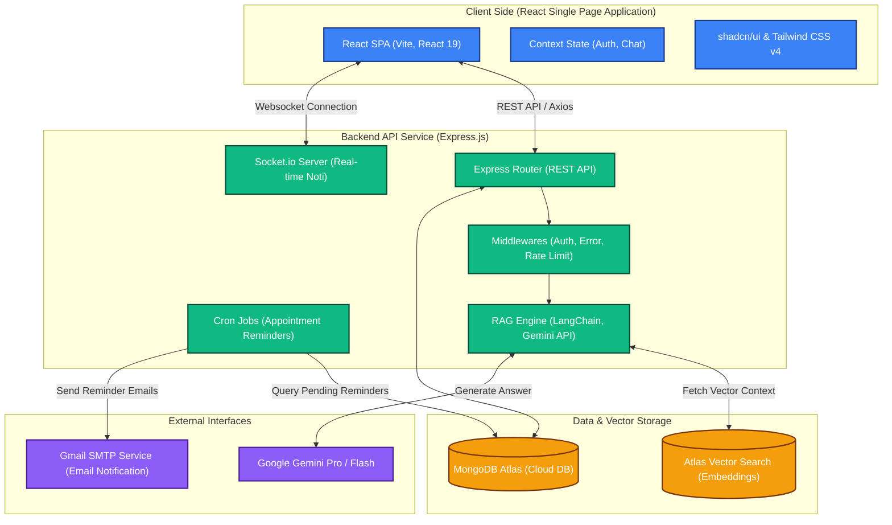
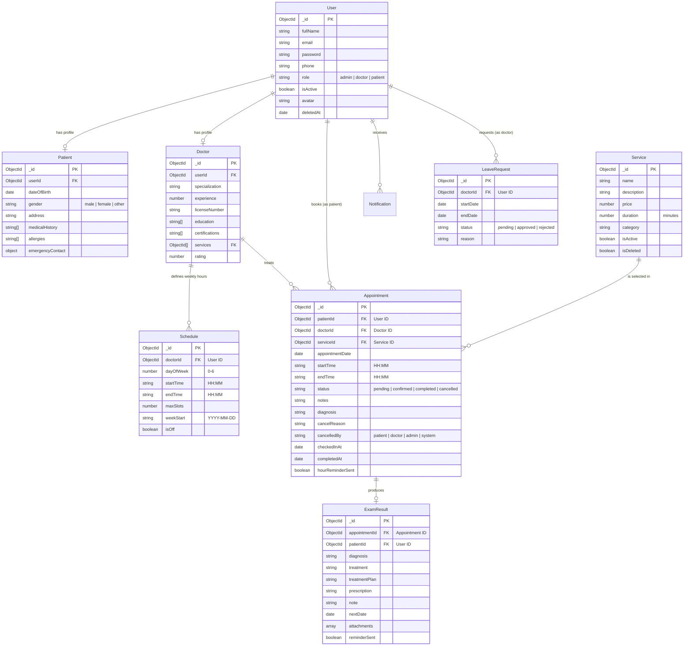

# 🦷 DentaCare — Hệ Thống Quản Lý Phòng Khám Nha Khoa Thông Minh & Trợ Lý RAG AI

[](https://mongodb.com)
[](https://react.dev)
[](https://nodejs.org)
[](https://www.mongodb.com/atlas)
[](https://deepmind.google/technologies/gemini/)

DentaCare là hệ thống quản lý phòng khám nha khoa toàn diện (Full-Stack), được phát triển nhằm tối ưu hóa quy trình vận hành lâm sàng, tự động hóa đặt lịch hẹn thông minh, quản lý hồ sơ bệnh án điện tử và tích hợp **Trợ lý ảo thông minh RAG (Retrieval-Augmented Generation)** hỗ trợ giải đáp chuyên môn nha khoa theo chuẩn kiến thức y khoa của phòng khám.

---

## 🏛️ Sơ đồ kiến trúc hệ thống (System Architecture)

Hệ thống được thiết kế theo mô hình **Client-Server kiến trúc phân lớp (layered architecture)** đảm bảo tính mở rộng (scalability), bảo mật, giao tiếp thời gian thực qua WebSockets và xử lý AI thông minh qua luồng RAG.



---

## 📊 Sơ đồ thực thể liên kết (Entity-Relationship Diagram - ERD)

Cơ sở dữ liệu MongoDB được thiết kế chuẩn hóa cao, tối ưu chỉ mục (indexes) để truy vấn nhanh chóng, chống xung đột lịch hẹn (race condition) và lưu trữ dữ liệu RAG thông minh.



---

## ⚡ Tính Năng Nổi Bật

### 1. Phân quyền đa vai trò chuyên sâu (Multi-tenant Authorization)
*   **Bệnh nhân (Patient):** Quản lý hồ sơ cá nhân, lịch sử điều trị, tra cứu kết quả khám nha khoa, chủ động đặt lịch hẹn thông minh (realtime check) và nhận tư vấn trực tiếp từ AI Chatbot.
*   **Bác sĩ (Doctor):** Theo dõi lịch khám hàng tuần, phê duyệt lịch hẹn, ghi nhận chẩn đoán/kế hoạch điều trị chuyên sâu, kê đơn thuốc điện tử, quản lý nghỉ phép và cập nhật kết quả lâm sàng.
*   **Quản trị viên (Admin):** Quản lý bác sĩ/bệnh nhân, thiết lập danh mục dịch vụ & đơn giá, phân bổ lịch làm việc hàng loạt (bulk scheduling), theo dõi báo cáo doanh thu & tần suất dịch vụ trực quan bằng biểu đồ và huấn luyện dữ liệu y khoa (RAG) cho AI.

### 2. Hệ thống đặt lịch thông minh chống Race Condition
*   Hệ thống kiểm tra tính khả dụng thực tế của bác sĩ dựa trên lịch làm việc cố định, lịch xin nghỉ phép (approved leaves), và các lịch hẹn đã được đặt.
*   Tích hợp chỉ mục **MongoDB Unique Partial Index** ngăn chặn triệt để hiện tượng đặt trùng lịch (double-booking) ngay cả khi hàng trăm bệnh nhân bấm nút đặt cùng một mili-giây.

### 3. Tương tác thời gian thực (Real-time Communication)
*   Sử dụng **Socket.io** đồng bộ dữ liệu lập tức trên dashboard admin, bác sĩ và bệnh nhân khi có lịch hẹn mới, lịch hẹn được duyệt, hủy lịch hoặc cập nhật lịch làm việc.
*   Hệ thống thông báo đẩy (push notifications) tức thời để nhân viên phòng khám xử lý yêu cầu nhanh nhất.

### 4. Trợ lý RAG AI Đa nhiệm & Đào tạo Tri thức Y khoa
*   Không chỉ là chatbot trả lời thông thường, AI Chatbot tại DentaCare tích hợp kỹ thuật **RAG (Retrieval-Augmented Generation)** sử dụng cơ sở tri thức nha khoa của phòng khám được tải lên dưới dạng tài liệu (.pdf, .docx, .xlsx).
*   Văn bản được chunk nhỏ, tạo vector nhúng (vector embeddings) bằng Gemini Embedding model và lưu trữ trực tiếp vào **MongoDB Atlas Vector Search**.
*   Khi bệnh nhân hỏi, AI tìm kiếm ngữ cảnh có độ tương đồng cosine (cosine similarity) cao nhất và dùng Gemini Pro sinh câu trả lời chuẩn khoa học, trung thực và mang tính cá nhân hóa cao.

### 5. Nhắc hẹn Tự động (Cron Jobs Email Service)
*   Hệ thống chạy ngầm tự động gửi email nhắc lịch hẹn trước 24 giờ và trước 1 giờ khám bằng **Nodemailer**, tích hợp sẵn mẫu thư HTML sang trọng, tối ưu tỷ lệ vắng hẹn của bệnh nhân (no-show rate).

---

## 🛠️ Công Nghệ Phát Triển (Tech Stack)

### **Frontend**
*   **Core framework:** React 19 + Vite 8 (Tốc độ biên dịch cực nhanh, tải trang tức thì)
*   **Styling:** Tailwind CSS v4 (Hệ thống CSS hiện đại nhất) + shadcn/ui + Radix UI
*   **Routing:** React Router DOM v7
*   **State Management & Requests:** React Context API + Axios (interceptors tự động gắn JWT)
*   **UI/UX Enhancements:** Lucide Icons, Sonner (Toast thông báo mượt mà), Recharts (Vẽ biểu đồ báo cáo)

### **Backend**
*   **Server framework:** Node.js + Express.js
*   **Database:** MongoDB Atlas (NoSQL)
*   **Realtime communication:** Socket.io v4
*   **Authentication:** JWT Dual-Token (AccessToken ngắn hạn bảo mật + RefreshToken lưu trong HTTP-Only Cookie chống XSS/CSRF)
*   **Security:** Helmet, CORS, Express Rate Limit, Input Validation với Joi.
*   **Background processing:** Node-cron

### **AI / RAG Pipeline**
*   **LLM API:** Google Gemini API (Gemini-2.5-flash & Gemini-2.0-flash)
*   **Orchestrator:** LangChain.js / Core API
*   **Vector Database:** MongoDB Atlas Vector Search
*   **Document Parsers:** Pdf-parse, Mammoth (cho DOCX), XLSX

---

## 🚀 Hướng Dẫn Cài Đặt Nhanh

### 1. Tải dự án
```bash
git clone https://github.com/MoonCoderVN/Clinic-web-manager.git
cd Clinic-web-manager
```

### 2. Cấu hình Backend (Server)
1. Di chuyển vào thư mục server và cài đặt dependencies:
   ```bash
   cd server
   npm install
   ```
2. Tạo file `.env` từ file mẫu `.env.example` và điền đầy đủ các thông tin kết nối Database, khóa API Gemini và cấu hình SMTP Mail:
   ```bash
   cp .env.example .env
   ```
3. **Cực kỳ quan trọng (Khóa luận tốt nghiệp):** Khởi tạo toàn bộ dữ liệu mẫu chuẩn chỉ để demo bằng câu lệnh:
   ```bash
   npm run seed
   ```
   *Lệnh này sẽ tự động xóa dữ liệu rác, khởi tạo tài khoản Admin, 7 Dịch vụ nha khoa lớn, 10 Bác sĩ chuyên khoa, 30 Bệnh nhân mẫu, lịch trực tuần hoàn và 10 Lịch hẹn thực tế trải đều các trạng thái khác nhau cùng 4 Bệnh án mẫu.*
4. Khởi động server ở chế độ phát triển:
   ```bash
   npm run dev
   ```

### 3. Cấu hình Frontend (Client)
1. Di chuyển vào thư mục client và cài đặt:
   ```bash
   cd ../client
   npm install
   ```
2. Khởi động client:
   ```bash
   npm run dev
   ```
3. Mở trình duyệt truy cập: [http://localhost:5173](http://localhost:5173)

---

## 🔑 Dữ Liệu Demo Khóa Luận Tốt Nghiệp

Dưới đây là thông tin tài khoản đã được chuẩn bị đầy đủ qua lệnh `npm run seed`:

### 1. Tài khoản Quản trị viên (Admin)
*   **Email:** `admin@dentacare.com`
*   **Mật khẩu:** `Admin@123456`

### 2. Danh sách Bác sĩ chuyên khoa (Doctor)
*   **BS. Nguyễn Văn An** (Thẩm mỹ & Bọc sứ) - Email: `dr.an@dentacare.com` | MK: `Doctor@123456`
*   **BS. Trần Thị Bình** (Chỉnh nha) - Email: `dr.binh@dentacare.com` | MK: `Doctor@123456`
*   **BS. Phạm Minh Cường** (Cấy ghép Implant) - Email: `dr.cuong@dentacare.com` | MK: `Doctor@123456`
*   **BS. Lê Hoàng Dũng** (Nha khoa tổng quát) - Email: `dr.dung@dentacare.com` | MK: `Doctor@123456`
*   **BS. Hoàng Thu Thảo** (Nha khoa trẻ em) - Email: `dr.thao@dentacare.com` | MK: `Doctor@123456`
*   **BS. Đặng Anh Tuấn** (Điều trị nha chu) - Email: `dr.tuan@dentacare.com` | MK: `Doctor@123456`
*   **BS. Mai Phương Chi** (Tẩy trắng răng) - Email: `dr.chi@dentacare.com` | MK: `Doctor@123456`
*   **BS. Phan Thanh Sơn** (Cấy ghép Implant) - Email: `dr.son@dentacare.com` | MK: `Doctor@123456`
*   **BS. Lê Quốc Khánh** (Invisalign chuyên sâu) - Email: `dr.khanh@dentacare.com` | MK: `Doctor@123456`
*   **BS. Đỗ Thùy Linh** (Nội nha vi phẫu) - Email: `dr.linh@dentacare.com` | MK: `Doctor@123456`

### 3. Danh sách Bệnh nhân mẫu (Patient)
*   **Mật khẩu chung cho toàn bộ 30 bệnh nhân:** `Patient@123456`
*   **Một số tài khoản bệnh nhân tiêu biểu:**
    *   **Lê Minh Triết** - Email: `patient.triet@gmail.com` *(Có tiền sử dị ứng Penicillin)*
    *   **Nguyễn Hoài Thương** - Email: `patient.thuong@gmail.com`
    *   **Phan Anh Đức** - Email: `patient.duc@gmail.com` *(Có tiền sử huyết áp cao nhẹ)*
    *   **Vũ Phương Vy** - Email: `patient.vy@gmail.com`
    *   **Trần Minh Hoàng** - Email: `patient.hoang@gmail.com`
    *   **Phạm Thúy Hằng** - Email: `patient.hang@gmail.com` *(Dị ứng thuốc aspirin)*
    *   **Tạ Thị Bé** (Bệnh nhi) - Email: `patient.be@gmail.com`
    *   *(Và 23 bệnh nhân khác đã được seed đầy đủ vào database)*

---

## 📸 Hình Ảnh Giao Diện Demo (Screenshots Guide)

> [!TIP]
> Hãy chụp lại các màn hình thực tế của ứng dụng trên máy của bạn và lưu vào thư mục `/assets/screenshots/` (nếu chưa có, hãy tạo thư mục này) để hiển thị trực quan trong báo cáo và file README trên GitHub.

Các màn hình quan trọng cần chụp và thay thế liên kết bên dưới:

1.  **Trang chủ (Landing Page):** Giới thiệu phòng khám, bảng giá dịch vụ tích hợp Chatbot RAG AI góc màn hình.
    
2.  **Đặt lịch hẹn (Patient Booking):** Quy trình đặt lịch chọn dịch vụ, bác sĩ, ngày khám và chọn slot giờ trống thời gian thực cực kỳ trực quan.
    
3.  **Hồ sơ bệnh án điện tử (Medical Records):** Nơi bệnh nhân xem lịch sử điều trị, kết quả chẩn đoán và đơn thuốc đã kê.
    
4.  **Lịch khám Bác sĩ (Doctor Dashboard):** Quản lý danh sách lịch khám hôm nay, thao tác phê duyệt, check-in, hủy lịch và ghi bệnh án lâm sàng.
    
5.  **Quản trị hệ thống (Admin Dashboard):** Thống kê doanh thu, số lượng đặt lịch, biểu đồ tần suất dịch vụ, quản lý bác sĩ, phân lịch hàng loạt và giao diện cập nhật tài liệu đào tạo RAG AI.
    
